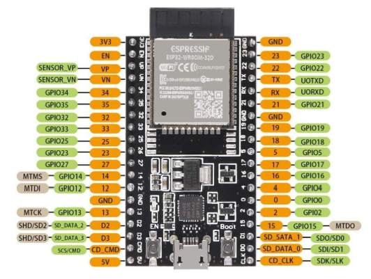
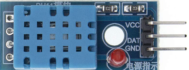
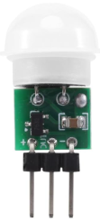
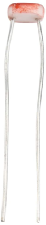
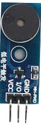
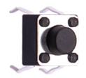
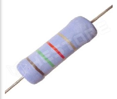
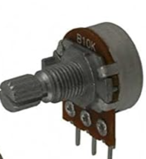
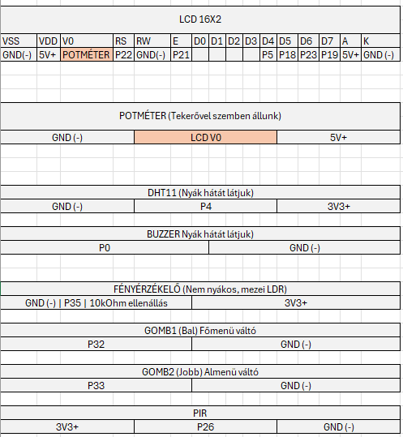

# ESP32 alapú IoT környezetfigyelő (LCD + MQTT)

A projekt célja egy ESP32 mikrokontrollerre épülő **környezetfigyelő** megvalósítása, amely:

- méri a **hőmérsékletet, páratartalmat és hőérzetet** (DHT11),
- figyeli a **fényviszonyokat** (LDR fényérzékelő),
- **mozgást érzékel** PIR szenzorral,
- az adatokat **16×2 karakteres LCD-n** jeleníti meg több menüben,
- két gombbal vezérelhető (főmenü + alternatív nézet),
- rövid **hangjelzést** ad visszacsatolásként (buzzer),
- a mért adatokat **TLS-sel védett MQTT kapcsolat** segítségével egy felhőalapú brokerre küldi.

---


## Tartalom

- [ESP32 alapú IoT környezetfigyelő (LCD + MQTT)](#esp32-alapú-iot-környezetfigyelő--lcd--mqtt)
  - [Tartalom](#tartalom)
  - [Feladat](#feladat)
    - [Készítők](#készítők)
    - [Követelmények](#követelmények)
  - [Megvalósítás](#megvalósítás)
      - [Fizikai eszközök](#fizikai-eszközök)
      - [Bill of Materials (BOM)](#bill-of-materials-bom)
      - [Áramellátás és tápfeszültségek](#áramellátás-és-tápfeszültségek)
      - [Szenzorok és bekötésük](#szenzorok-és-bekötésük)
      - [Kijelző és kezelőfelület](#kijelző-és-kezelőfelület)
      - [Jelzőeszközök](#jelzőeszközök)
  - [Szoftveres környezet](#szoftver)
      - [Programozás](#programozás)
  - [Főbb funkcionális modulok](#főbb-funkcionális-modulok)
      - [Menürendszer és gombkezelés](#menürendszer-és-gombkezelés)
      - [MQTT adatmodell](#mqtt-adatmodell)
  - [A működés rövid leírása](#a-működés-rövid-leírása)
  - [Továbbfejlesztési lehetőség – bébiőr mód](#továbbfejlesztési-lehetőség--bébiőr-mód)
  - [About](#about)

---

## Feladat

A Nyíregyházi Egyetem **IoT alapok** tantárgyában a feladat egy **IoT eszköz** megtervezése és megvalósítása volt.

Elgondolásunk alapján a mi eszközünk:
- különböző szenzorokkal adatot gyűjt a környezetről,
- a mért értékeket lokálisan kijelzi,
- a mért adatokat **hálózaton keresztül továbbítja** egy MQTT broker felé.

### Készítők

- **Kulcsár Béla**
- **Orosz Richárd**
- **Kocserha Patrik**


### Követelmények

A projektnek tartalmaznia kellett:
**Eszközöket (esetünket):**
- egy **mikrokontroller-platformot** (ESP32),
- többféle **szenzort** (hőmérséklet, páratartalom, fény, mozgás),
- **kijelzőt** (16×2 LCD),
- **aktuátort** (buzzer),
- **felhasználói kezelőfelületet** (gombok, menü),
- **WiFi kapcsolatot**,
- **MQTT alapú adatküldést** (JSON formátum)
  
**Dokumentációt:**
- **leírás**(README.md).
- **eszközlista** (BOM)
- **bekötésirajz**
- **bekötéshez lábkiosztás**
- **képek a működésről**
- **forráskód** (megjegyzésekkel)
- **specifikáció** (feladatleírás,cél,lépések)

---

## Megvalósítás

### Fizikai eszközök

#### Bill of Materials (BOM)

| #  | Megnevezés                         | Típus / leírás                            | Tápfeszültség | Mennyiség |Kép|
|----|------------------------------------|-------------------------------------------|--------------:|-----------|---|
| 1  | ESP32 fejlesztőpanel               | ESP-WROOM-32 DevKit (USB-s)              | 5 V (USB) / 3,3 V logika | 1 db | |
| 2  | 16×2 LCD kijelző                   | HD44780 kompatibilis, párhuzamos          | 5 V           | 1 db      | |
| 3  | DHT11 szenzor                      | Hőmérséklet + páratartalom                | 3,3–5 V (3,3 V-ról használva) | 1 db | |
| 4  | PIR mozgásérzékelő modul           | Digitális kimenet                         | 5 V táp, 3,3 V kompatibilis kimenet | 1 db | |
| 5  | Fényérzékelő (LDR + R osztó / modul)| Analóg kimenet (ADC-re)                  | 3,3 V         | 1 db      | |
| 6  | Buzzer                             | Aktív/passzív hangjelző                   | 3,3 V         | 1 db      | |
| 7  | Nyomógomb                          | Momentary push button                     | 3,3 V logika (pullup-pal) | 2 db | |
| 8  | Ellenállások                       | LDR osztóhoz, gombokhoz                   | 3,3 V szint   | 1 db      | |
| 9  | Breadboard                          | Próbaáramkörhöz                           | —             | 1 db      | |
| 10  | male-male kábelek         | Próbaáramkörhöz                           | —             | n db      | |
| 11  | female-male kábelek         | Próbaáramkörhöz                           | —             | n db      | |
| 12 | microUSB kábel / 5 V adapter       | ESP32 tápellátás                          | 5 V           | 1 db      | |
| 13 | Potencióméter       | kijelző fényerő állítás                         | 5 V           | 1 db      | |

---

#### Áramellátás és tápfeszültségek

- Az **ESP32 fejlesztőpanel** egy **5 V-os USB tápról** kapja a tápot (PC vagy telefontöltő).
- A panel saját **3,3 V-os LDO stabilizátora** állítja elő a logikai tápfeszültséget.
- A 3,3 V sínről táplálódik:
  - DHT11 VCC,
  - fényérzékelő (LDR osztó/modul),
  - buzzer,
  - gombok pull-up referencia,
  - PIR szenzor
- Az LCD kijelző **5 V-ról üzemel**.
---

#### Szenzorok és bekötésük




**DHT11 (hőmérséklet + páratartalom)**

- VCC → 3,3 V
- GND → GND
- DATA → `PIN_DHT = 4` (ESP32 GPIO4)
- A `DHT` könyvtár gondoskodik a lekérdezésről; a kódban 2 másodpercenként frissítjük.

**Fényérzékelő (LDR + osztó / modul)**

- LDR + fix ellenállás → feszültségosztó 3,3 V és GND között
- Osztó középpont → `PIN_LIGHT = 35` (ADC bemenet)
- ADC tartomány: 0–4095 (ESP32, 0–~3,1 V között, `analogSetAttenuation(ADC_11db)` )

**PIR mozgásérzékelő**

- VCC → 5 V (a modul specifikációja szerint)
- GND → GND
- OUT → `PIN_PIR = 26` (ESP32 digitális bemenet)
- HIGH → mozgás észlelve, LOW → nincs mozgás.

---

#### Kijelző és kezelőfelület

**16×2 LCD (HD44780 kompatibilis)**

- VCC → 5 V  
- GND → GND  
- Kontraszt → potméteren keresztül GND–5 V között  
- RS → `PIN_LCD_RS = 22`  
- E  → `PIN_LCD_E  = 21`  
- D4 → `PIN_LCD_D4 = 5`  
- D5 → `PIN_LCD_D5 = 18`  
- D6 → `PIN_LCD_D6 = 23`  
- D7 → `PIN_LCD_D7 = 19`  

A kijelző **4 bites módban** működik, `LiquidCrystal` könyvtárral vezérelve.

**Gombok**

- **GOMB1** – lapozás a menük között  
  - egyik láb → `PIN_BTN1 = 32`  
  - másik láb → GND  
  - a kódban `INPUT_PULLUP` módban használjuk → nyomáskor LOW
- **GOMB2** – Alt menü váltása  
  - egyik láb → `PIN_BTN2 = 33`  
  - másik láb → GND  
  - szintén `INPUT_PULLUP` → nyomáskor LOW

Debounce: `DEBOUNCE_MS = 200 ms`.

---

#### Jelzőeszközök

**Buzzer**

- + → `PIN_BUZZER = 0`  
- – → GND  
- Rövid csipogás: `beepBuzzer()` – 50 ms magas szint.

A buzzer:

- minden gombnyomáskor jelzést ad,
- később riasztási funkciókra (pl. bébiőr mód) is felhasználható.

---
## Szoftveres környezet
Ha megtörtént az eszközök beszerzése és a mellékeletek szerinti összekötés, akkor ezt követően szükséges a szoftveres kivitelezést az Arduino IDE-vel tudjuk megvalósítani.
- **Arduino IDE 2.3.6** telepítését követően, szükséges további lépések megtétele:
    -File->Preferences->Additional boards manager URLs-ba beillesztjük:**https://dl.espressif.com/dl/package_esp32_index.json**
-Boards manager-ből telepítjük az: **"esp32 by Espressif Systems" 3.3.4.**
-Library manager-ből telepítjük: **Adafruit Unified Sensor, DHT sensor library, LiquidCrystal**

Ezt követően csatlakoztathatjuk az eszközt adatátvitelre alkalmas MicroUSB kábellal a gépünkhőz, amennyiben eszközkezelőben nem jelenik meg a COM-port, úgy telepíteni kell a:

CP210x USB to UART Bridge VCP Drivers, a www.silabs.com -ról.

---

## Programozás

A kód **Arduino keretrendszerben** készült ESP32-höz.  
Fő forrásfájl: pl. `src/main.cpp` vagy `beadando.ino` (a repo struktúrájától függően).

### Főbb funkcionális modulok

- **Szenzor frissítés**
  - `handleDHT()` – 2 másodpercenként lekérdezi a DHT11-et, és frissíti:
    - `lastT` – hőmérséklet,
    - `lastH` – páratartalom,
    - `lastHI` – hőérzet.
  - `ReadLight()` – visszaadja az aktuális fény ADC értéket.
  - `readPir()` – visszaadja a PIR logikai állapotát.

- **WiFi + MQTT inicializálás**
  - `init_wifi()` – csatlakozás a megadott SSID-hez, legfeljebb 20 próbálkozással.
  - `init_mqtt()` – broker cím, port, TLS beállítás (`WiFiClientSecure`).
  - `mqtt_reconnect()` – szükség esetén újracsatlakozik, hibakódot ír a Serialra.

- **MQTT adatküldés**
  - `sendMqttData()`:
    - JSON objektumot épít a legutóbbi mért értékekből,
    - az `mqtt_topic`-ra publikálja,
    - 2 percenként hívódik (`MQTT_INTERVAL`).

- **Logolás, futásidő**
  - `Uptime()` – futásidő formázása `HH:MM:SS` alakban (LCD-re vagy Serialra).
  - `printSerialLine()` – soros monitorra írt diagnosztika (hő, pára, hőindex, fény, futásidő); csak akkor ír, ha a korábbi értékhez képest érdemi változás van.

---

### Menürendszer és gombkezelés

A kijelzőn 4 fő menü jelenik meg, a `currentMenu` változó szerint:

1. **DHT adatok**
2. **Fényérzékelő**
3. **Mozgásérzékelő (PIR)**
4. **ESP hálózati adatok / uptime**

Az `AltMenu` logikai változó jelzi, hogy az adott menü **alapnézete** vagy **alternatív nézete** aktív.

**GOMB1 (bal, PIN_BTN1 = 32)**

- Főmenük között lépked: `1 → 2 → 3 → 4 → 1 → ...`
- Minden nyomás:
  - debounce után érvényes,
  - `currentMenu` növelése,
  - `showLCD()` frissítés,
  - `beepBuzzer()` hívása.

**GOMB2 (jobb, PIN_BTN2 = 33)**

- Az aktuális menü **AltMenu** állapotát váltja (`AltMenu = !AltMenu`),
- LCD frissítés,
- buzzer csippanás.

**Menünézetek röviden:**

- **Menü 1 – DHT11**
  - Alap:
    - Sor1: `Homers.: <T>°C`
    - Sor2: `Paratart.: <H>%`
  - Alt:
    - Sor1: `Hoerzet: <HI>°C`
    - Sor2: `Fenyero: Sotet/Kozepes/Vilagos` (ADC határértékek szerint)

- **Menü 2 – Fény**
  - Alap: `ADC ertek: <0..4095>`
  - Alt: `Feny: sotet / kozepes / vilagos`

- **Menü 3 – Mozgás**
  - Sor1: `Mozgas erzekeles`
  - Sor2: `Mozgas ESZLELVE` vagy `Mozgas NINCS`

- **Menü 4 – ESP info**
  - Alap:
    - Sor1: `MAC:<espMac>`
    - Sor2: `IP:<espIP>` vagy `NINCS WIFI!`
  - Alt:
    - Sor1: `Start ota eltelt`
    - Sor2: futásidő (`Uptime(..., true)`).

---

### MQTT adatmodell

A broker eléréséhez a kódban beállított paraméterek:

```cpp
const char* mqtt_broker   = "86a4864e38404fa0ac3975d7ee622fb3.s1.eu.hivemq.cloud";
const int   mqtt_port     = 8883;
const char* mqtt_username = "28562F4A74A8";
const char* mqtt_password = "Nyiregyhaziegyetem1";
const char* mqtt_topic    = "esp32/28562F4A74A8";
